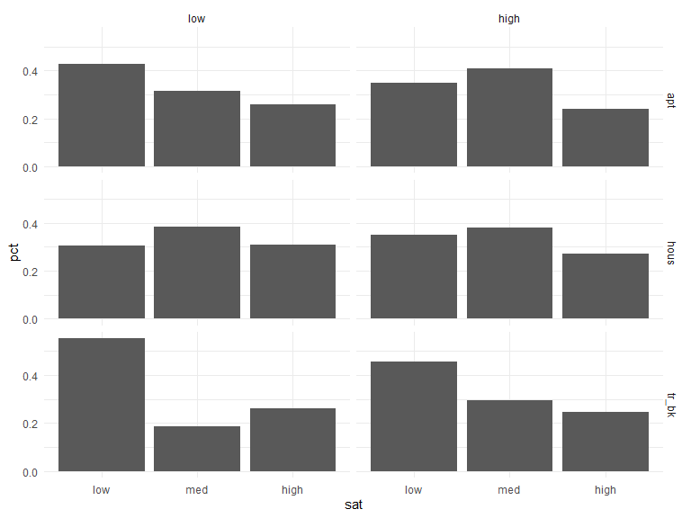
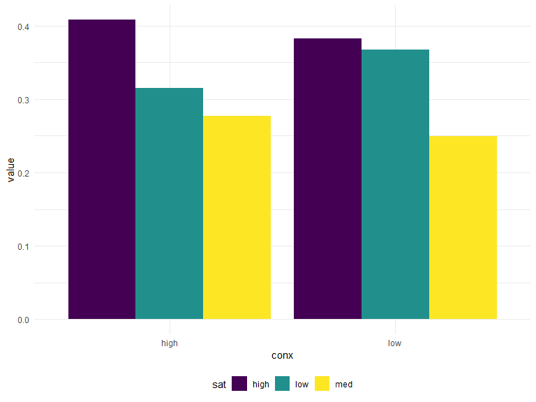
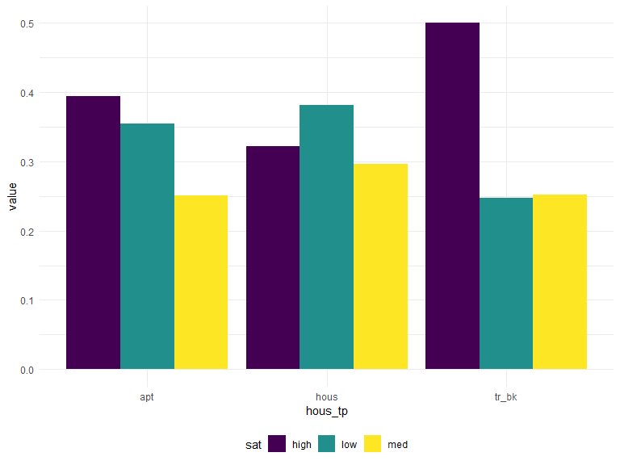

p8131\_hw4\_jsg2145
================
Jared Garfinkel
2/20/2020

``` r
df_low = tibble(
  conx = rep(c("low", "high"), 3),
  hous_tp = rep(c("tr_bk", "apt", "hous"), each = 2),
  values = c(65, 34, 130, 141, 67, 130)
) %>% 
  mutate(sat = "low") 

df_med = tibble(
  conx = rep(c("low", "high"), 3),
  hous_tp = rep(c("tr_bk", "apt", "hous"), each = 2),
  values = c(54, 47, 76, 116, 48, 105)
) %>% 
  mutate(sat = "med")

df_high = tibble(
  conx = rep(c("low", "high"), 3),
  hous_tp = rep(c("tr_bk", "apt", "hous"), each = 2),
  values = c(100, 100, 111, 191, 62, 104)
) %>% 
  mutate(sat = "high")

df_sum = union(df_low, df_med) %>% 
  union(df_high) %>% 
  unnest() %>% 
  pivot_wider(names_from = sat, values_from = values)

df_tbl = df_sum %>% 
  group_by(conx, hous_tp) %>% 
  mutate(n = sum(low, med, high)) %>% 
  summarize(low = low/n,
            med = med/n,
            high = high/n)
```

``` r
df_conx = df_sum %>%
  group_by(conx) %>% 
  summarize(low = sum(low),
            med = sum(med),
            high = sum(high),
            n = sum(low, med, high)) %>% 
  group_by(conx) %>% 
  summarize(low = low/n,
            med = med/n,
            high = high/n)
```

``` r
df_hous_tp = df_sum %>%
  group_by(hous_tp) %>% 
  summarize(low = sum(low),
            med = sum(med),
            high = sum(high),
            n = sum(low, med, high)) %>% 
  group_by(hous_tp) %>% 
  summarize(low = low/n,
            med = med/n,
            high = high/n)
```

``` r
df_tidy_tbl = df_tbl %>% 
  pivot_longer(cols = c(low, med, high), names_to = "sat", values_to = "pct") %>% 
  ungroup() %>% 
  mutate(sat = str_remove(sat, "_pct$"),
         sat = factor(sat, labels = c("low", "med", "high")),
         conx = factor(conx, labels = c("low", "high")),
         hous_tp = factor(hous_tp, labels = c("apt", "hous", "tr_bk")))
```

``` r
df_tidy_tbl %>% 
  ggplot(aes(x = sat, y = pct)) +
  geom_col() +
  facet_grid(hous_tp~conx)
```



``` r
df_conx %>% 
  pivot_longer(cols = low:high, names_to = "sat") %>% 
  ggplot(aes(x = conx, y = value, fill = sat)) +
  geom_bar(position = "dodge", stat = "identity")
```



``` r
df_hous_tp %>% 
  pivot_longer(cols = low:high, names_to = "sat") %>% 
  ggplot(aes(x = hous_tp, y = value, fill = sat)) +
  geom_bar(position = "dodge", stat = "identity")
```



``` r
hagen.multi = nnet::multinom(cbind(low, med, high) ~ conx + hous_tp, data = df_sum)
```

    ## # weights:  15 (8 variable)
    ## initial  value 1846.767257 
    ## iter  10 value 1803.046285
    ## final  value 1802.740161 
    ## converged

``` r
summary(hagen.multi)
```

    ## Call:
    ## nnet::multinom(formula = cbind(low, med, high) ~ conx + hous_tp, 
    ##     data = df_sum)
    ## 
    ## Coefficients:
    ##      (Intercept)    conxlow hous_tphous hous_tptr_bk
    ## med   -0.2180364 -0.2959832  0.06967922    0.4067631
    ## high   0.2474047 -0.3282264 -0.30402275    0.6415948
    ## 
    ## Std. Errors:
    ##      (Intercept)   conxlow hous_tphous hous_tptr_bk
    ## med   0.10930968 0.1301046   0.1437749    0.1713009
    ## high  0.09783068 0.1181870   0.1351693    0.1500774
    ## 
    ## Residual Deviance: 3605.48 
    ## AIC: 3621.48

It appears that low contact with neighbors is associated with lower
medium and high satisfaction holding housing type constant, while higher
contact with neighbors is associated with an increase in medium and high
satisfaction in the tower block housing compared to apartments. But,
there is no clear trend between satisfaction and house type between
houses and apartments while holding contact constant.

``` r
pihat = predict(hagen.multi, type = "probs") 
m = rowSums(df_sum[3:5])
res.pearson = (df_sum[3:5] - pihat * m) / sqrt(pihat * m)
```

``` r
G.stat = sum(res.pearson ^ 2) # Generalized Pearson Chisq Stat
G.stat
```

    ## [1] 6.932341

``` r
pval = 1 - pchisq(G.stat, df = (6 - 4) * (3 - 1))
pval
```

    ## [1] 0.1395072

The p-value is 0.14, so we do not reject the null, indicating the fit is
acceptable.

``` r
tidy.err = summary(hagen.multi)$standard.error %>% 
  broom::tidy() %>% 
  mutate(value = "err")

tidy.coef = summary(hagen.multi)$coefficients %>% 
  broom::tidy() %>% 
  mutate(value = "coef")

tidy.multi = union(tidy.coef, tidy.err) %>% 
  janitor::clean_names() %>% 
  dplyr::select(-x_intercept) %>% 
  pivot_longer(cols = c(conxlow, hous_tphous, hous_tptr_bk), values_to = "estimate") %>% 
  pivot_wider(names_from = value, values_from = estimate)
```

``` r
tidy.ci = tidy.multi %>% 
  group_by(rownames, name) %>% 
  mutate(
    lower = (coef - qnorm(.975) * err),
    upper = (coef + qnorm(.975) * err)) %>%
  dplyr::select(rownames, name, lower, upper) %>% 
  ungroup() %>% 
  rename(sat = rownames, par = name)

tidy.ci %>% 
  knitr::kable(digits = 3)
```

| sat  | par            |   lower |   upper |
| :--- | :------------- | ------: | ------: |
| med  | conxlow        | \-0.551 | \-0.041 |
| med  | hous\_tphous   | \-0.212 |   0.351 |
| med  | hous\_tptr\_bk |   0.071 |   0.743 |
| high | conxlow        | \-0.560 | \-0.097 |
| high | hous\_tphous   | \-0.569 | \-0.039 |
| high | hous\_tptr\_bk |   0.347 |   0.936 |

We are 95% confident the log odds ratio of reporting medium satisfaction
compared to low satisfaction will fall between -0.551 and -0.041 for low
contact compared to high contact holding house type constant.

We are 95% confident the log odds ratio of reporting medium satisfaction
compared to low satisfaction will fall between -0.212 and 0.351 for
people living in houses compared to those living in apartments holding
contact constant.

We are 95% confident the log odds ratio of reporting medium satisfaction
compared to low satisfaction will fall between 0.071 and 0.743 for
people living in tower blocks compared to those living in apartments
holding contact constant.

We are 95% confident the log odds ratio of reporting high satisfaction
compared to low satisfaction will fall between -0.56 and -0.097 for
people who reported low contact compared to those who reported high
contact holding housing type constant.

We are 95% confident the log odds ratio of reporting high satisfaction
compared to low satisfaction will fall between -0.569 and -0.039 for
people who live in houses compared to those who live in apartments
holding contact constant.

We are 95% confident the log odds ratio of reporting high satisfaction
compared to low satisfaction will fall between 0.347 and 0.936 for
people who live in tower blocks compared to those who live in apartments
holding contact constant.

``` r
# proportional odds model
freq = df_sum %>%
  pivot_longer(cols = c(low, med, high), names_to = "sat")

df_ord = df_tidy_tbl %>% 
  left_join(freq, by = c("sat", "conx", "hous_tp")) %>% 
  mutate(sat = factor(sat, 
                      levels = c("low", "med", "high"), 
                      ordered = TRUE))

# fit proportional odds model
df_polr = polr(sat ~ conx + hous_tp, data = df_ord, weights = value)

summary(df_polr)
```

    ## 
    ## Re-fitting to get Hessian

    ## Call:
    ## polr(formula = sat ~ conx + hous_tp, data = df_ord, weights = value)
    ## 
    ## Coefficients:
    ##                Value Std. Error t value
    ## conxlow      -0.2524    0.09306  -2.713
    ## hous_tphous  -0.2353    0.10521  -2.236
    ## hous_tptr_bk  0.5010    0.11675   4.291
    ## 
    ## Intercepts:
    ##          Value   Std. Error t value
    ## low|med  -0.7488  0.0818    -9.1570
    ## med|high  0.3637  0.0801     4.5393
    ## 
    ## Residual Deviance: 3610.286 
    ## AIC: 3620.286

The change in log odds of falling into a lower satisfaction category
associated with low contact is -0.252 compared to high contact holding
housing type constant.

The change in log odds of falling into a lower satisfaction category
associated with living in a house is -0.235 compared to those living in
apartments holding level of contact constant.

The change in log odds of falling into a lower satisfaction category
associated with living in a tower block is 0.501 compared to those
living in apartments holding level of contact constant.

## Part iii

``` r
# Pearson residuals for proportional odds model

pihat = predict(df_polr, df_sum, type = 'p')
m = df_sum %>% 
  group_by(conx, hous_tp) %>% 
  mutate(total = sum(low, med, high)) %>% 
  ungroup() %>% 
  dplyr::select(total) %>% 
  as_vector()
res.pearson = (df_sum[,3:5] - pihat * m) / sqrt(pihat * m)
G = sum(res.pearson^2)
G
```

    ## [1] 11.64205

``` r
numsamp = (3 - 1) * 6 # degree of freedom for grouped data
numparam = 2 + 3 # total num of param
pval = 1 - pchisq(G, df = numsamp - numparam)
pval
```

    ## [1] 0.112962

The p-value is 0.113 (\>0.05), indicating that the model is a good fit.
