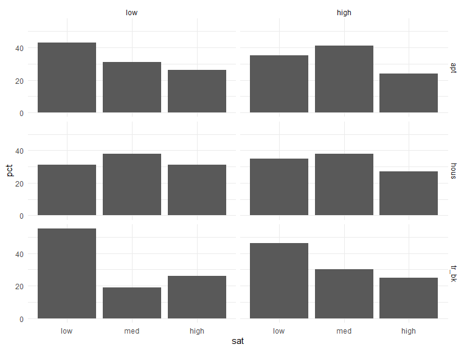

p8131\_hw4\_jsg2145
================
Jared Garfinkel
2/20/2020

``` r
df_low = tibble(
  conx = rep(c("low", "high"), 3),
  hous_tp = rep(c("tr_bk", "apt", "hous"), each = 2),
  values = c(65, 34, 130, 141, 67, 130)
) %>% 
  mutate(sat = "low") 

df_med = tibble(
  conx = rep(c("low", "high"), 3),
  hous_tp = rep(c("tr_bk", "apt", "hous"), each = 2),
  values = c(54, 47, 76, 116, 48, 105)
) %>% 
  mutate(sat = "med")

df_high = tibble(
  conx = rep(c("low", "high"), 3),
  hous_tp = rep(c("tr_bk", "apt", "hous"), each = 2),
  values = c(100, 100, 111, 191, 62, 104)
) %>% 
  mutate(sat = "high")

df_sum = union(df_low, df_med) %>% 
  union(df_high) %>% 
  unnest() %>% 
  pivot_wider(names_from = sat, values_from = values) %>% 
  group_by(conx, hous_tp) %>% 
  mutate(n = sum(low, med, high))


df_tbl = df_sum %>% 
  group_by(conx, hous_tp) %>% 
  summarize(low_pct = round(low/n*100, digits = 0),
            med_pct = round(med/n*100, digits = 0),
            high_pct = round(high/n*100, digits = 0)
  )
```

``` r
df_tbl %>% knitr::kable()
```

| conx | hous\_tp | low\_pct | med\_pct | high\_pct |
| :--- | :------- | -------: | -------: | --------: |
| high | apt      |       31 |       26 |        43 |
| high | hous     |       38 |       31 |        31 |
| high | tr\_bk   |       19 |       26 |        55 |
| low  | apt      |       41 |       24 |        35 |
| low  | hous     |       38 |       27 |        35 |
| low  | tr\_bk   |       30 |       25 |        46 |

``` r
df_tidy_tbl = df_tbl %>% 
  pivot_longer(cols = c(low_pct, med_pct, high_pct), names_to = "sat", values_to = "pct") %>% 
  ungroup() %>% 
  mutate(sat = str_remove(sat, "_pct$"),
         sat = factor(sat, labels = c("low", "med", "high")),
         conx = factor(conx, labels = c("low", "high")))
```

``` r
df_tidy_tbl %>% 
  ggplot(aes(x = sat, y = pct)) +
  geom_col() +
  scale_fill_brewer(palette = "Blues") +
  facet_grid(hous_tp~conx)
```



``` r
hagen.multi = nnet::multinom(cbind(low, med, high) ~ conx + hous_tp, data = df_sum)
```

    ## # weights:  15 (8 variable)
    ## initial  value 1846.767257 
    ## iter  10 value 1803.046285
    ## final  value 1802.740161 
    ## converged

``` r
summary(hagen.multi)
```

    ## Call:
    ## nnet::multinom(formula = cbind(low, med, high) ~ conx + hous_tp, 
    ##     data = df_sum)
    ## 
    ## Coefficients:
    ##      (Intercept)    conxlow hous_tphous hous_tptr_bk
    ## med   -0.2180364 -0.2959832  0.06967922    0.4067631
    ## high   0.2474047 -0.3282264 -0.30402275    0.6415948
    ## 
    ## Std. Errors:
    ##      (Intercept)   conxlow hous_tphous hous_tptr_bk
    ## med   0.10930968 0.1301046   0.1437749    0.1713009
    ## high  0.09783068 0.1181870   0.1351693    0.1500774
    ## 
    ## Residual Deviance: 3605.48 
    ## AIC: 3621.48

``` r
pihat = predict(hagen.multi, type = "probs") 
m = rowSums(df_sum[3:5])
res.pearson = (df_sum[3:5] - pihat * m) / sqrt(pihat * m)
```

``` r
G.stat = sum(res.pearson ^ 2) # Generalized Pearson Chisq Stat
G.stat
```

    ## [1] 6.932341

``` r
pval = 1 - pchisq(G.stat, df = (6 - 4) * (3 - 1))
pval
```

    ## [1] 0.1395072

The p-value is 0.1395072, so we do not reject the null, indicating the
fit is acceptable.

There is a
